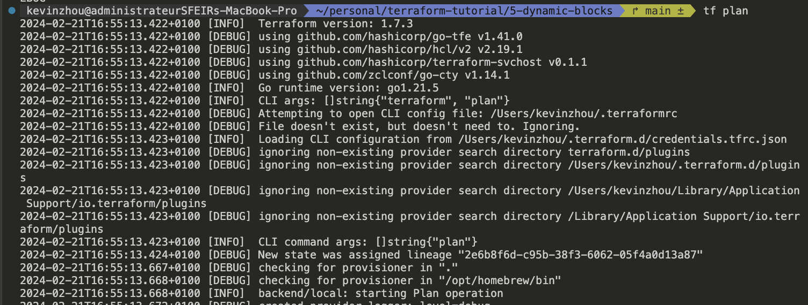

## A- AWS configuration
### 1- Creating AWS account 

- with a free-tier available for 12 months: https://aws.amazon.com/fr/free/?all-free-tier.sort-by=item.additionalFields.SortRank&all-free-tier.sort-order=asc&awsf.Free%20Tier%20Types=*all&awsf.Free%20Tier%20Categories=*all
- it includes 750 hours of EC2 compute for t2.mico so enough for our ressources configured in `main.tf`

- 5 Go of S3 storage bucket

### 2- Generating AWS credentials
This was a hassle finding the right documentation and navigating through all.
https://docs.aws.amazon.com/IAM/latest/UserGuide/id_credentials_access-keys.html#Using_CreateAccessKey
In the end, just need to:
* go to aws console
* go to the profile > Security credentials > Access keys
* create access key (careful: Root user access keys are not recommended and is not a best practice)
* run 
```sh
export AWS_ACCESS_KEY_ID=XXX
export AWS_SECRET_ACCESS_KEY=XXX
```

## 3- Install Terraform CLI

https://developer.hashicorp.com/terraform/tutorials/aws-get-started/install-cli
If using zsh, terraform autocomplete and alias can be added in the ~/.zshrc. Cf https://github.com/ohmyzsh/ohmyzsh/blob/master/plugins/terraform/README.md

## 4- (Optional for tutorial) Install AWS CLI

https://docs.aws.amazon.com/cli/latest/userguide/getting-started-install.html
```sh
curl "https://awscli.amazonaws.com/AWSCLIV2.pkg" -o "AWSCLIV2.pkg"
sudo installer -pkg AWSCLIV2.pkg -target /
which aws
aws --version
```

## B- Terraform commands

```
cd `dir`
terraform init # downloads and installs the providers defined in the configuration in .terraform
               # create a file .terraform.lock.hcl containing dependency lock file
terraform fmt # format the config files (indentation...)
terraform validate # validate config files (check on syntax and consistency with respect to variables and existing states)
terraform plan # create an execution plan
               # Reads the current state of any already-existing remote objects to make sure that the Terraform state is up-to-date.
               # Compares the current configuration to the prior state and noting any differences.
               # Proposes a set of change actions that should, if applied, make the remote objects match the configuration.
terraform apply # executes the actions in the execution plan
                # When applied your configuration, Terraform wrote data into a file called terraform.tfstate

terraform state
terraform state list # list of the resources in your project's state.

terraform destroy
terraform refresh = terraform apply -refresh-only -auto-approve  read remote objects and update state file
terraform apply -var "instance_name=YetAnotherName" # Setting variables via the command-line
terraform output # Terraform prints output values to the screen when you apply your configuration.

```

## C- Interesting features 

* Debugging terraform: we can set the var TF_LOG to (TRACE,DEBUG,INFO,WARN,ERROR,JSON) to enable detailed logging.
`JSON` will output at TRACE level or higher 
`export TF_LOG=DEBUG`


* Terraform_remote_state: it is a data source and retrieves the output values from another tf configuration. # https://youtu.be/SPcwo0Gq9T8?si=1HmLj2TXJBDCXVvI&t=12674. Alternatives (live like s3) data sources should be privileged if possible. 

* State locking # https://youtu.be/SPcwo0Gq9T8?si=wdGzD0Pe-z-CFuud&t=12793. State will be locked for all operations that could write state to prevent mutiple writrers.

* Run triggers: allow triggers of apply when successful apply of runs in any "source" workspace. This allows to handle dependencies and update values when a workspace rely on information (remote states/output data) produced by another workspace. https://youtu.be/SPcwo0Gq9T8?si=4ltie56q3SUTkOtO&t=17866 

* Sentinal : policy as code framework (paid service part of team and governance package)
    * ex: restrict instance types of VMs/EC2
    * restrict availbility zones used by EC2
    * require storage buckets to be encrypted by KMS keys
    * enforce mandatory labels
    * enforce limits on K8S clusters

 * Packer: developper tool to provision a build image that will be stored in a repository
 

 * Consul: service networking platform for micro-service architectures => service discovery (central registry for services in the network) / service mesh ( managing traffic between services)

 * Vault: securely accessing secrets from different secrets data stores. It is deployed in a server.
  